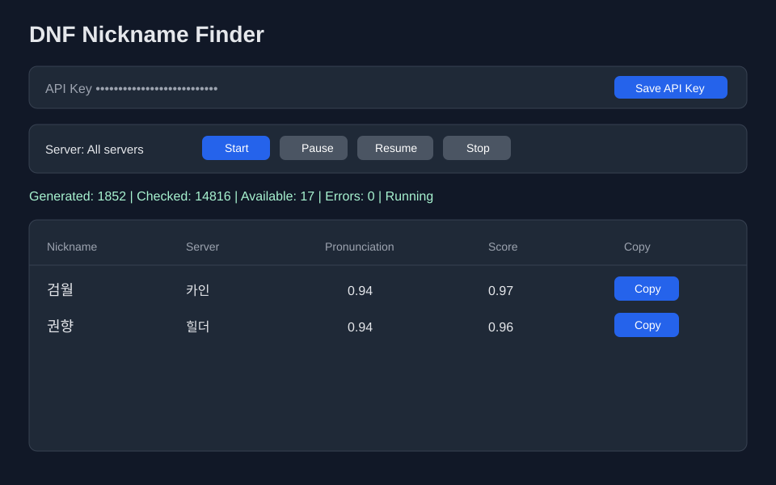

# DNF Nickname Finder

A production-ready Windows desktop app for finding available Dungeon & Fighter character nicknames using the Neople API.

## Features

- Python 3.12 and PySide6 desktop UI
- Modern responsive dark-mode interface
- OS credential-store persistence for the Neople API key via `keyring`
- JSON persistence for non-secret settings
- Rotating application logs
- Server selector with single-server or all-server search
- Korean two-character female martial-arts nickname generator
- Dictionary-based candidate generation with pronunciation and rarity scoring
- Filters common Korean given names and duplicated syllable patterns
- Multi-threaded availability checking with retries, cancellation, progress, and client-side rate limiting
- TXT and CSV export
- GitHub Actions workflow to build a Windows executable with PyInstaller on every push

## Screenshot



## Usage

1. Create or paste your Neople API key, then click **Save API Key**.
2. Choose **All servers** or a specific server.
3. Click **Start** to continuously generate and check nicknames in the background.
4. Use **Pause**, **Resume**, or **Stop** to control the search without closing the app.
5. Only available nicknames are added to the results table. Click **Copy** beside a result to copy it.
6. Click **Export TXT** or **Export CSV** at any time to export the current results without stopping the search.

## Setup

```bash
python -m venv .venv
.venv\\Scripts\\activate
pip install -r requirements.txt
python main.py
```

On macOS/Linux, activate the virtual environment with `source .venv/bin/activate`.

## Neople API Key

Enter your Neople API key in the application and click **Save API Key**. The key is stored using the operating system credential store; it is not written to the JSON settings file.

## Development

```bash
pip install -r requirements.txt
pytest
```

## Build Windows EXE Locally

```bash
pyinstaller --noconfirm --windowed --name "DNF Nickname Finder" main.py
```

The executable bundle will be created under `dist/`.
